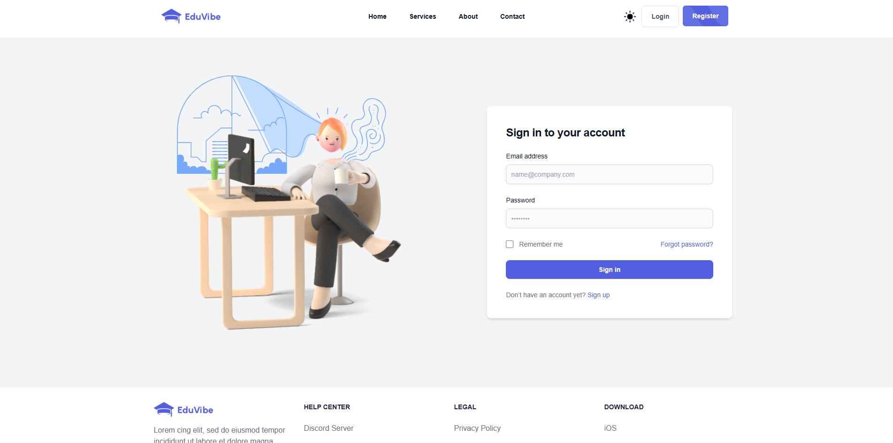
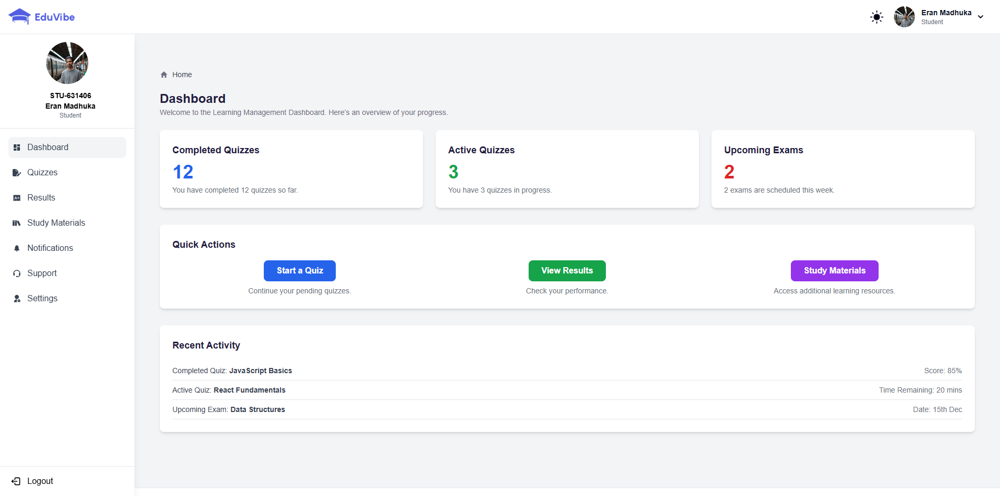
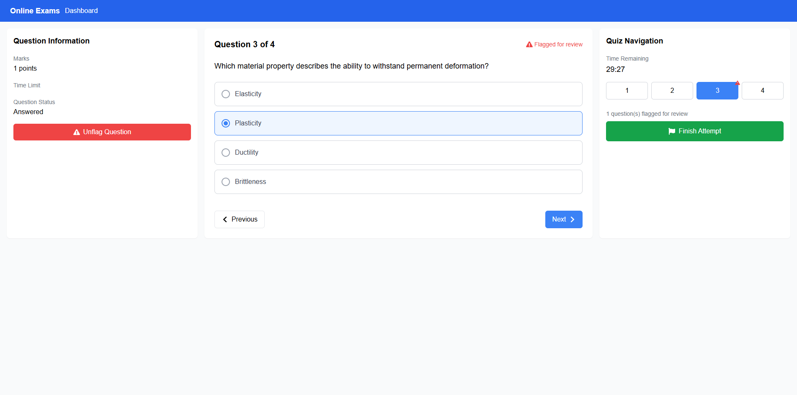
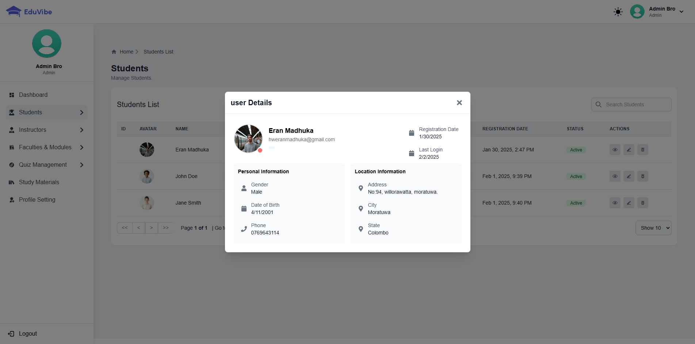

# ProjectMID - Online Exam Platform

ProjectMID is a MERN stack-based online exam platform designed for university students. It provides role-based access control, allowing students to register, select faculties, choose modules, and take quizzes. Admins and instructors can manage users, faculties, modules, quizzes, and questions.

---

## 📌 Features

### 🔹 Student Features

- Register & login to the system.
- Select faculty -> choose a module -> take a quiz.
- View exam results after completion.

### 🔹 Instructor Features

- Manage quizzes and questions.
- Create quizzes based on modules.
- View student performance.

### 🔹 Admin Features

- Manage students, instructors, faculties, and modules.
- Assign modules to instructors.
- Manage quizzes and questions.

### 🔹 General Features

- Secure authentication (Role-Based Access Control - RBAC).
- Organized exam structure with faculties and modules.
- User-friendly dashboard for each role.

---

## 🛠️ Tech Stack

- **Frontend:** React.js
- **Backend:** Node.js, Express.js
- **Database:** MongoDB
- **Authentication:** JWT

---

## 🚀 Getting Started

### 1️⃣ Clone the Repository

```bash
   git clone https://github.com/eranmadhuka/projectMid.git
   cd ProjectMID
```

### 2️⃣ Install Dependencies

```bash
   # Install backend dependencies
   cd backend
   npm install

   # Install frontend dependencies
   cd ../frontend
   npm install
```

### 3️⃣ Configure Environment Variables

Create a `.env` file in the `backend/` directory and add:

```env
PORT=5000
MONGO_URI=your_mongodb_connection_string
JWT_SECRET=your_secret_key
```

### 4️⃣ Run the Application

```bash
   # Start backend server
   cd backend
   npm start

   # Start frontend
   cd ../frontend
   npm start
```

---

## 🔑 Default Login Credentials

### Admin

- **Email:** [admin@email.com](mailto\:admin@email.com)
- **Password:** [admin@email.com](mailto\:admin@email.com)

### Instructor

- **Email:** [sarah.williams@example.com](mailto\:sarah.williams@example.com)
- **Password:** [sarah.williams@example.com](mailto\:sarah.williams@example.com)

### Student

- **Email:** [jane.smith@example.com](mailto\:jane.smith@example.com)
- **Password:** [jane.smith@example.com](mailto\:jane.smith@example.com)

---

## 📸 Screenshots

### 🔹 Login Page



### 🔹 Student Dashboard



### 🔹 Quiz Interface



### 🔹 Admin Panel



